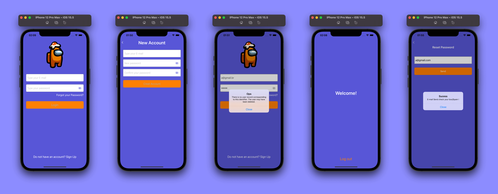

# LoginViewCode

Full flow login screen with validations

## Used Technologies:
  🔹View Code
  🔹FIrebase
  🔹Cocoapods
  
  ## Configration

After cloning the project, installing the pods:

```
$ cd LoginViewCode
$ pod install
$ open LoginViewCode.xcworkspace
```

Run the build in Xcode.

## Screenshots



## Video App Working:

[](https://www.youtube.com/watch?v=fZuFghtHTtg)

